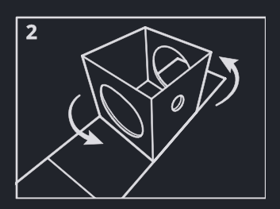
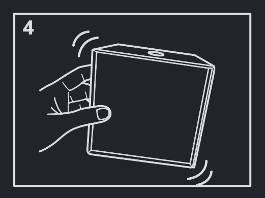

<h1>Qubigo is here! 
    Easy to learn, hard to master
</h1>

Qubigo is a strategic game designed for 2-3 players, where the goal is to create a row of 3 pieces with a shared feature. It can be played on different levels of complexity.

    <a class="button-link" href="https://shop.qubigo.com" target="_blank">Order your Qubigo game</a>

Players must develop a 3D strategy while preventing their friends from scoring
points. With just 27 moves to victory, Qubigo is a game that requires a sharp
mind and calculated risk-taking.

The desktop game is now for sale in 2 versions, made in Amsterdam by our founders Rob and Anton.

    
    
    

# The Dutch edition

Our second product, the Dutch Edition, features 4 levels and Dutch miniatures of windmills, tulips and Amsterdam houses. Are your more interested in the Dutch edition? Click the image below.

# Qubigo app

With the Qubigo app you can challenge your friends anytime, anywhere.
The app is currently being developed and tested. We aim to release Q1 2026.
Be one of the first in the world to play this game! If you want to become a test player,
or want to be updated about the release: Leave your email here.

<form class="form"
    action="https://docs.google.com/forms/u/0/d/e/1FAIpQLSfT2swN3VCQUnda3ts0ieLxOP2esuiLtlE7s6WADvSDjioO7g/formResponse"
    method="post" target="hidden_iframe" onsubmit="submitted=true">
    

        <input type="email" name="entry.1538940267" placeholder="Email address" tabindex="0" required=""
            dir="auto" data-lpignore="true" data-initial-dir="auto" data-initial-value="">
        <input type="submit" value="Send" />
    

</form>

# Setting up

Gently lift the cube out of the box - it's packaged with all the pieces.

Turn the magnetic box 90 degrees - it's now a shaker!

Pour all the 27 pieces from the cube into the shaker.

Shake out 3 pieces per player and place them in front of you.

To make the game more challenging, you can make more than three pieces visible to all players. The more pieces you see, the more strategic it gets. Ultimate challenge: make all pieces visible.

# Game rules

## Objective

Be the player who scores the most points by lining up three pieces that share a common feature in any direction. Pieces come in 3 structures: solid, open and ribbed

    
color, e.g.:

    

        
        
        
    

    
shape, e.g.:

    

        
        
        
    

    
structure, e.g.:

    

        
        
        
    

## Gameplay

1. Players take turns making a move.
2. Place one of your pieces in an open position in any layer in the cube.
3. Click the three layers togetherby turning the logos in the middle in the same direction.

1. After placing a piece, shake out a new one so you always have three visible.
5. Record your points with the score card and score pieces. Game ends when the cube is full. 

## Scoring

A row with **one** shared feature gives 1 point.  
For example:

    

        
        
        
    

    

        
        
        
    

    

        
        
        
    

    

        
        
        
    

A row with **two** shared features gives two points.  
For example:

    

        
        
        
    

    

        
        
        
    

    

        
        
        
    

    

        
        
        
    

# Online fun

With the Qubigo app you can challenge your friends anywhere, anytime.

Leave your email and we let you know when the app is released.

<form class="form"
    action="https://docs.google.com/forms/u/0/d/e/1FAIpQLSfT2swN3VCQUnda3ts0ieLxOP2esuiLtlE7s6WADvSDjioO7g/formResponse"
    method="post" target="hidden_iframe" onsubmit="submitted=true">
    

        <input type="email" name="entry.1538940267" placeholder="Email address" tabindex="0" required=""
            dir="auto" data-lpignore="true" data-initial-dir="auto" data-initial-value="">
        <input type="submit" value="Send" />
    

</form>
