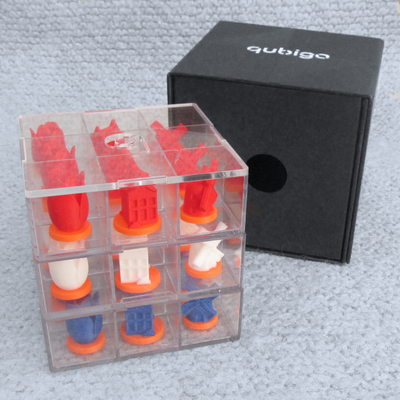
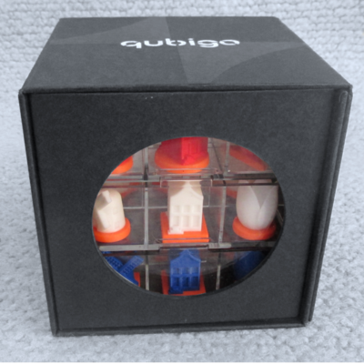

# Dutch edition released for SAIL 2025

    <a class="button-link" href="https://shop.qubigo.com/products/qubigo-dutch-edition-sail-2025" target="_blank">Order the Dutch Edition</a>

Qubigo is a strategic game designed for 2-3 players, where the goal is to create a row of 3 pieces with a shared feature. It can be played on different levels of complexity.

The Dutch edition features little windmills, Amsterdam canal houses and tulips, in the Dutch colors red, white and blue. 
This version has three levels, from kids to chess players. An original gift for hours of game fun.

Players must develop a 3D strategy while preventing their friends from scoring
points. With just 27 moves to victory, Qubigo is a game that requires a sharp
mind and calculated risk-taking. 

 
    
    
    

